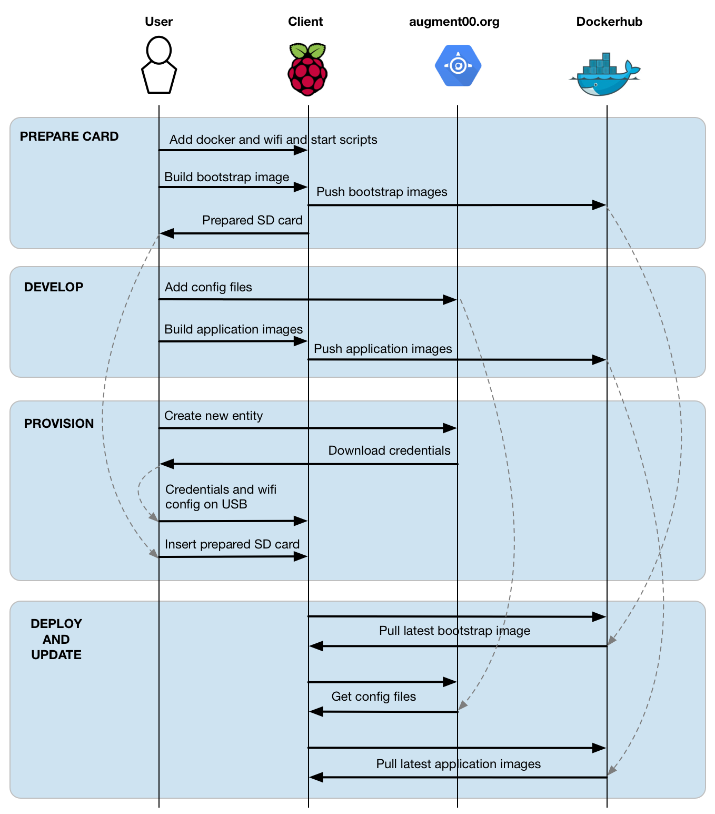

# Augment00 Registry

This registry app is a Google App Engine app that provides the core registration and configuration services used by Augment00 clients.
This is in the src folder and the readme is here [src/README.md](src/README.md)

The plan is that all clients are plug-and-play with a USB attached to each desk that provides minimal credentials and configuration.
The Raspberry Pis will be given a base images on sd cards that has just jessie lite, docker/compose and a simple startup script.
All applications are to be downloaded as docker images and all further configuration pulled from the regisrty service.
This will make possible:

- Plug-and-play provisioning without the need for keyboards/screen etc
- Over the air updating of both code and configuration
- Simple ongoing support and maintenance




## Run Locally
1. Install the [App Engine Python SDK](https://developers.google.com/appengine/downloads).
See the README file for directions. You'll need python 2.7 and [pip 1.4 or later](http://www.pip-installer.org/en/latest/installing.html) installed too.

2. Clone this repo with

   ```
   git clone git@github.com:augment00/a00_registry.git
   ```
3. Install dependencies in the project's lib directory.
   Note: App Engine can only import libraries from inside your project directory.

   ```
   cd a00_registry/src
   pip install -r requirements.txt -t lib
   ```
4. Run this project locally from the command line:

   ```
   dev_appserver.py .
   ```

Visit the application [http://localhost:8080](http://localhost:8080)

See [the development server documentation](https://developers.google.com/appengine/docs/python/tools/devserver)
for options when running dev_appserver.

## Deploy
To deploy the application:

1. install gcloud command line tools [https://cloud.google.com/sdk/downloads](https://cloud.google.com/sdk/downloads)

2. from a00_registry/src run:  `gcloud --project=project00-msme app deploy`